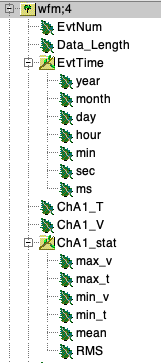

# DRS4bin2root
This is a `C++` program that automatically convert binary dat file from DRS4 to CERN root file. This program is developed mainly based on previous conversion program by Prof. Kim Siang Khaw.  
Supported system: Linux & MacOS\
Author: Meng Lyu (Shanghai Jiao Tong University)\
Date: 2024/01/28

## Description
This program supports automatic channel number detection and up to 2 DRS4 boards in daisy-chain mode. Processing data from more
than 2 boards is not supported.  
The output file format is the same as the output from [picoCSV2root package](https://github.com/TwinklyStar/picoCSV2root/tree/main)
so that data from two digitizers can share the same analysis program (as provided in demo).

## Installation
Make sure you can use ROOT before installation

```
git clone https://github.com/TwinklyStar/DRS4bin2root.git
cd DRS4bin2root
make
```
If there is no error, an executable file `DRS4bin2root` should appear.
## Demo
### Convert dat to ROOT
```
./DRS4bin2root demo/7ch_example.dat
```

## Analysis
### Visualize first 10 waveforms (analysis example)
Go to `ana` directory
```
cd ana/drawWaveform
./run_drawWaveform.sh
```
Check `plots` folder, the first 10 waveforms of demo should be saved  
Please change the offset and channel number to fit with your data

### Simple analysis example
Go to `ana` folder and find the `simpAna.cpp`. You can develop you own analysis code based on this example.  
To run demo:
```
root -l -q simpAna.C
```
To use it to your own data:
```
root -l -q 'simpAna.C("/path/to/your/data")'
```

### File structure
The output root file structure in tree `wfm` is as follows:
<div align=center></div>

Compared with picoCSV2root output, the data contain one additional branch `EvtTime`, and the rest are the same:

```
EvtNum: UInt_t  // Original event number of each waveform (not the event number in TTree)
                // Because during CSV conversion, some events will be discarded due to overflow
                
Data_Length: Int_t  // Number of data point (fixed 1024 for DRS4, flexibale for picoScope)

EvtTime:  // Capture time of each event (pico ver. does't have this branch)
    year: Short_t
    month: Short_t
    day: Short_t
    hour: Short_t
    min: Short_t
    sec: Short_t
    ms: Short_t

ChA(/B/C/D)1(/2)_T: *std::vector<Double_t>  // Time (ns for DRS4, ns-ms for picoScope)
ChA(/B/C/D)1(/2)_V: *std::vector<Double_t>  // Voltage (mV for DRS4, mV-V for picoScope)

ChA(/B/C/D)1(/2)_stat:  // Some simple statistics of each waveform
   max_v: Double_t  // Maximum voltage
   max_t: Double_t  // Time where the maximum voltage locates
   min_v: Double_t  // You know what it means
   min_t: Double_t  // You know what it means
   mean:  Double_t  // mean of the voltage vector
   RMS:   Double_t  // RMS of the voltage vector
```

